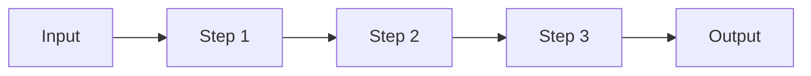

# Planning a Task

**Announce:** "Using kn-plan for task [ID]."

**Core principle:** GATHER CONTEXT → PLAN → VALIDATE → WAIT FOR APPROVAL.

## Inputs

- Task ID, or `--from @doc/designs/<name>` for SDD task generation
- Existing task refs, spec refs, template refs, and user constraints

## Preflight

- Read the task or spec first
- Follow every explicit `@task-`, `@doc/`, and `@template/` ref before finalizing the plan
- Search for adjacent docs/tasks only after reading the primary source
- Do not write a plan that assumes undocumented architecture decisions

## Mode Detection

Check if `$ARGUMENTS` contains `--from`:
- **Yes** → Go to "Generate Tasks from Design" section
- **No** → Continue with normal planning flow

---

# Normal Planning Flow

## Step 1: Take Ownership

```json
mcp_knowns_tasks({ "action": "get", "taskId": "$ARGUMENTS" })
mcp_knowns_tasks({ "action": "update", "taskId": "$ARGUMENTS",
  "status": "in-progress",
  "assignee": "@me"
})
mcp_knowns_time({ "action": "start", "taskId": "$ARGUMENTS" })
```

## Step 2: Gather Context

Follow refs in task:
```json
mcp_knowns_docs({ "action": "get", "path": "<path>", "smart": true })
mcp_knowns_tasks({ "action": "get", "taskId": "<id>" })
```

If the task links to a design, use structural resolve to find related tasks and dependencies:
```json
mcp_knowns_search({ "action": "resolve", "ref": "@doc/designs/<name>{implements}", "direction": "inbound", "entityTypes": "task" })
```

Search related (unified search includes docs and memories):
```json
mcp_knowns_search({ "action": "search", "query": "<keywords>", "type": "doc" })
mcp_knowns_search({ "action": "search", "query": "<keywords>", "type": "memory" })
mcp_knowns_templates({ "action": "list" })
```

If relevant memories appear, factor them into the plan (past patterns, decisions, conventions).

If the plan needs assembled execution context rather than raw search hits, use retrieval after discovery:
```json
mcp_knowns_search({ "action": "retrieve", "query": "<keywords>" })
```
If MCP is unavailable, fall back to CLI: `knowns retrieve "<keywords>" --json`

Use `search` for discovery. Use `retrieve` when you need ranked candidates plus a context pack with citations.

## Step 3: Draft Plan

```markdown
## Implementation Plan
1. [Step] (see @doc/relevant-doc)
2. [Step] (use @template/xxx)
3. Add tests
4. Update docs
```

**Tip:** Use mermaid for complex flows (if plan has >3 steps):
````markdown

````

Plan quality rules:

- Steps should be outcome-oriented, not a dump of implementation details
- Mention concrete files, docs, or templates when known
- Include testing and validation explicitly
- Keep the plan short enough for approval, but specific enough to execute without re-discovery
- If supporting knowledge is too large, move it into a doc and reference it rather than bloating the plan

## Step 4: Save Plan

```json
mcp_knowns_tasks({ "action": "update", "taskId": "$ARGUMENTS",
  "plan": "1. Step one\n2. Step two\n3. Tests"
})
```

## Step 5: Validate

**CRITICAL:** After saving plan with refs, validate to catch broken refs:

```json
mcp_knowns_validate({ "entity": "$ARGUMENTS" })
```

If errors found (broken `@doc/...` or `@task-...`), fix before asking approval.

## Step 5.5: Pre-Execution Plan Check

Before presenting the plan for approval, verify plan quality:

### AC Coverage
- Every requirement from the task description should map to at least one plan step
- Every plan step should contribute to at least one AC
- Flag any AC that no plan step addresses

### Scope Sizing
- Each plan step should be completable in a single implementation session
- If a step requires reading >10 files or touching >5 files → recommend splitting
- If total plan exceeds ~8 steps → consider splitting into subtasks

### Dependency Check
- Plan steps should be in logical order (foundational first, dependent last)
- Flag circular dependencies between steps
- Flag steps that assume undocumented context

### Risk Assessment
- Steps involving new external dependencies → flag as higher risk
- Steps touching core/shared modules → flag blast radius
- Steps with no test coverage in plan → flag

### Complexity Rating

Assign a complexity rating to help the user calibrate effort:

| Rating | Criteria |
|--------|----------|
| **Low** | ≤3 steps, touches ≤3 files, no external deps |
| **Medium** | 4-6 steps, touches 4-6 files, some external deps |
| **High** | ≥7 steps, touches >6 files, complex deps, or cross-cutting changes |

**Report any issues found inline with the plan:**

```
Plan for task-<id> [Complexity: MEDIUM]
═══════════════════════════════════════
1. Step one
2. Step two
⚠️ Plan check: AC-3 not covered by any step
⚠️ Plan check: Step 4 touches 7 files — consider splitting

⚠️ Risk: Step 3 uses new external dependency (verify compatibility first)
```

Fix issues before presenting for approval. If unfixable, surface them explicitly so the user can decide.

## Step 6: Ask Approval

Present plan with complexity rating and **WAIT for explicit approval**.

## Final Response Contract

All built-in skills in scope must end with the same user-facing information order: `kn-init`, `kn-spec`, `kn-plan`, `kn-research`, `kn-implement`, `kn-verify`, `kn-doc`, `kn-template`, `kn-extract`, and `kn-commit`.

Required order for the final user-facing response:

1. Goal/result - state what plan or task preview was produced and whether approval is pending.
2. Key details - include the concise implementation plan, complexity rating, key assumptions, references used to derive the plan, and validation results.
3. Next action - recommend a concrete follow-up command only when a natural handoff exists.

Keep this concise for CLI use. Verification-specific content may extend the key-details section, but must not replace or reorder the shared structure.

Out of scope: explaining, syncing, or generating `.claude/skills/*`. Runtime auto-sync already handles platform copies, so this skill source only defines the built-in output contract.

For `kn-plan`, the key details should cover:

- the concise implementation plan
- complexity rating (Low/Medium/High)
- key assumptions or unresolved questions
- references used to derive the plan
- an explicit approval gate or validation result

---

## CRITICAL: Next Step Suggestion

**You MUST suggest the next action when a natural follow-up exists. User won't know what to do next.**

After user approves the plan:

```
Plan approved! Ready to implement.

Run: /kn-implement $ARGUMENTS
```

**If user wants to review first:**
```
Take your time to review. When ready:

Run: /kn-implement $ARGUMENTS
```

---

## Related Skills

- `/kn-research` - Research before planning
- `/kn-implement <id>` - Implement after plan approved
- `/kn-spec` - Create spec for complex features

## Checklist

- [ ] Ownership taken
- [ ] Timer started
- [ ] Refs followed
- [ ] Templates checked
- [ ] **Validated (no broken refs)**
- [ ] **Pre-execution plan check passed**
- [ ] Complexity rating assigned
- [ ] User approved
- [ ] **Next step suggested**

## Failure Modes

- Missing task/spec -> stop and report the missing ID/path
- Broken refs -> fix or replace them before asking approval
- Scope too large for one task -> recommend splitting instead of hiding complexity inside one plan

---

# Generate Tasks from Design

When `$ARGUMENTS` contains `--from @doc/designs/<name>`:

**Announce:** "Using kn-plan to generate tasks from design [name]."

## Step 1: Read Design Document

Extract design path from arguments (e.g., `--from @doc/designs/user-auth` → `designs/user-auth`).

```json
mcp_knowns_docs({ "action": "get", "path": "designs/<name>", "smart": true })
```

## Step 2: Design Approval Check (HARD ABORT)

**CRITICAL**: If the design does not exist or is not approved, STOP:

```
⛔ Design `designs/<name>` is not available or not approved yet.

Cannot generate tasks from a draft design. Please:
1. Run `/kn-design specs/<name>` to create and approve the design
2. Or check if the design exists at designs/<name>

Aborted — not creating tasks from unapproved design.
```

Only proceed if design exists and has been reviewed/approved.

## Step 3: Parse Requirements

Scan design for:
- **Architecture Decisions** (AD-1, AD-2, etc.)
- **Component Breakdown** (CLI, MCP, Storage, etc.)
- **Data Flow** (inputs, processing, outputs)
- **Acceptance Criteria** (AC-1, AC-2, etc.) - reference the underlying spec

Group related items into logical tasks.

## Step 4: Generate Task Preview

For each requirement/group, create task structure:

```markdown
## Generated Tasks from designs/<name> [Complexity: MEDIUM]
Total: X tasks

### Task 1: [Component/Feature Title] [LOW]
- **Description:** [From design]
- **ACs:**
  - [ ] AC from spec (referenced in design)
- **Design:** designs/<name>
- **Spec:** <linked-spec> (the spec this design derives from)
- **Fulfills:** AC-1, AC-2 (maps to Spec ACs this task completes)
- **Priority:** medium

### Task 2: [Component/Feature Title] [HIGH]
- **Description:** [From design]
- **ACs:**
  - [ ] AC from spec
- **Design:** designs/<name>
- **Spec:** <linked-spec>
- **Fulfills:** AC-3
- **Priority:** medium
```

> **CRITICAL:** The `fulfills` field maps Task → Spec ACs. When the task is marked done,
> the matching Spec ACs will be auto-checked in the spec document.

## Step 5: Ask for Approval

> I've generated **X tasks** from the design. Please review:
> - **Approve** to create all tasks
> - **Edit** to modify before creating
> - **Cancel** to abort

**WAIT for explicit approval.**

## Step 6: Create Tasks

When approved, create tasks with `fulfills` to link Task → Spec ACs:

```json
mcp_knowns_tasks({ "action": "create", "title": "<component/feature title>",
  "description": "<from design>",
  "spec": "<linked-spec>",
  "fulfills": ["AC-1", "AC-2"],
  "priority": "medium",
  "labels": ["from-design"]
})
```

Then add implementation ACs (task-level criteria, different from spec ACs):
```json
mcp_knowns_tasks({ "action": "update", "taskId": "<new-id>",
  "addAc": ["Implementation step 1", "Implementation step 2", "Tests added"]
})
```

> **Key Concept:**
> - `fulfills`: Which **Spec ACs** (AC-1, AC-2, etc.) this task satisfies
> - `addAc`: **Implementation ACs** - specific steps to complete the task
>
> When task status → "done", the `fulfills` ACs are auto-checked in the spec document.

Repeat for each task.

Creation rules:

- Group requirements into tasks that can be reviewed and completed independently
- Keep task ACs implementation-oriented, while `fulfills` stays mapped to spec AC IDs
- Reuse existing tasks if the spec overlaps current in-progress work; do not silently duplicate scope
- If the spec depends on broad domain knowledge, create/update a supporting doc and reference it from the spec or generated tasks
- If the spec reveals general platform work, create a dedicated task and reference it instead of hiding it inside an unrelated feature task

## Step 7: Summary

```markdown
Goal/result: created X tasks linked to `designs/<name>` (from spec <spec-name>).

Key details:
- task-xxx: Component/Feature 1 (3 ACs) [MEDIUM]
- task-yyy: Component/Feature 2 (2 ACs) [LOW]
- validation/approval status, if relevant

Next action:
- `/kn-plan <first-task-id>`
```

## Checklist (--from mode)

- [ ] Design document read
- [ ] **Design exists and is approved (hard abort if not)**
- [ ] Requirements from design parsed
- [ ] **Tasks include `fulfills` mapping to Spec ACs**
- [ ] Tasks previewed with complexity ratings
- [ ] User approved
- [ ] Tasks created with spec link and fulfills
- [ ] Summary shown