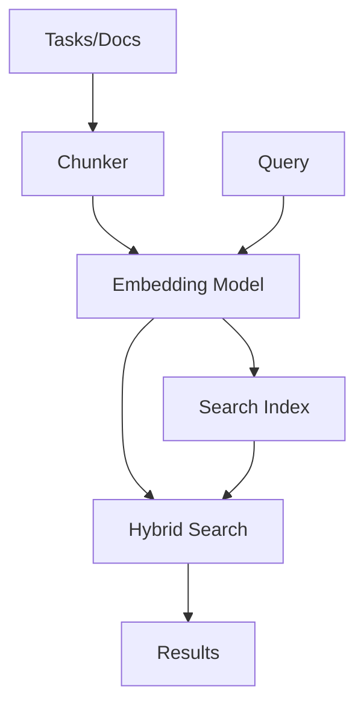

# Semantic Search Guide

Search tasks, docs, memories, and optionally indexed code by **meaning**, not just keywords. Uses local AI models with ONNX Runtime for privacy and offline capability.

## Table of Contents

- [Getting Started](#getting-started)
- [ONNX Runtime](#onnx-runtime)
- [Model Management](#model-management)
- [Search Usage](#search-usage)
- [Retrieval](#retrieval)
- [Code Intelligence](#code-intelligence)
- [Configuration](#configuration)
- [How It Works](#how-it-works)
- [Troubleshooting](#troubleshooting)

---

## Getting Started

### Enable During Init

```bash
knowns init my-project
# → "Enable semantic search?" [y/n] → y
# → "Select model:" → multilingual-e5-small (default) or gte-small
```

The model and ONNX Runtime download automatically to `~/.knowns/` (shared across projects). The shell and PowerShell install scripts also auto-run `knowns search --install-runtime` after installing the binary.

### Enable on Existing Project

You can run the full setup flow interactively:

```bash
knowns search --setup
```

Or do it step by step:

```bash
# 1. Install ONNX Runtime (install scripts already try this automatically)
knowns search --install-runtime

# 2. Enable in config
knowns config set settings.semanticSearch.enabled true

# 3. Download model (if not already)
knowns model download multilingual-e5-small

# 4. Build search index
knowns search --reindex
```

### Verify Setup

```bash
knowns search --status-check
# → ONNX Runtime: installed
# →   Path: ~/.knowns/lib/libonnxruntime.dylib
# → Model: multilingual-e5-small
# → Enabled: true
# → Index: 145 chunks (model: multilingual-e5-small)
# → Status: ready (hybrid search active)
```

---

## ONNX Runtime

Semantic search requires [ONNX Runtime](https://onnxruntime.ai/) to run embedding models locally. It is installed to `~/.knowns/lib/` and shared across all projects.

### Install ONNX Runtime

```bash
knowns search --install-runtime
```

This downloads the correct ONNX Runtime shared library for your platform (`darwin/arm64`, `darwin/x64`, `linux/x64`, `windows/x64`, etc.) and extracts it to `~/.knowns/lib/`. The install scripts for macOS, Linux, and Windows run this automatically after installing `knowns`; rerun it manually only if that step fails or you skipped the installer.

### Check Status

```bash
knowns search --status-check
```

If ONNX Runtime is missing, search queries fall back to keyword-only mode, but semantic indexing commands still require the runtime to be installed.

---

## Model Management

Models are stored globally at `~/.knowns/models/` and shared across all projects.

### Available Models

| Model                    | Dims | Max Tokens | HuggingFace ID                          | Best For                              |
| ------------------------ | ---- | ---------- | --------------------------------------- | ------------------------------------- |
| `gte-small`              | 384  | 512        | `Xenova/gte-small`                      | Good balance, English-focused         |
| `all-MiniLM-L6-v2`      | 384  | 256        | `Xenova/all-MiniLM-L6-v2`              | Fastest, smallest                     |
| `gte-base`               | 768  | 512        | `Xenova/gte-base`                       | Higher quality, English-focused       |
| `bge-small-en-v1.5`     | 384  | 512        | `Xenova/bge-small-en-v1.5`             | Strong retrieval quality              |
| `bge-base-en-v1.5`      | 768  | 512        | `Xenova/bge-base-en-v1.5`              | Top retrieval quality                 |
| `nomic-embed-text-v1.5`  | 768  | 8192       | `nomic-ai/nomic-embed-text-v1.5`       | Long context (8K tokens)              |
| `multilingual-e5-small`  | 384  | 512        | `Xenova/multilingual-e5-small`          | Multilingual support (default)        |

### Commands

```bash
# List downloaded models
knowns model list

# Download a model
knowns model download gte-small

# Remove a model
knowns model remove gte-small
```

### First Download

First model download may take 1-2 minutes depending on connection. A progress UI shows download status for each file:

```
  ⊙ Setting up semantic search (3 downloads)...

  ✓ ONNX Runtime (darwin/arm64) (12MB)
  ✓ multilingual-e5-small — model.onnx (471MB)
  ✓ multilingual-e5-small — tokenizer.json (1.2MB)

✓ Semantic search ready
```

---

## Search Usage

### Basic Search

```bash
# Semantic search (auto-enabled when configured)
knowns search "how to handle authentication errors"

# Force keyword-only search
knowns search "auth error" --keyword

# Search specific type
knowns search "api design" --type doc
knowns search "login bug" --type task
knowns search "auth pattern" --type memory

# Limit results
knowns search "auth" --limit 5
```

### Search Output

```bash
$ knowns search "user authentication flow"

DOCS (2 results):
  patterns/auth.md (score: 0.89)
    "JWT authentication pattern with refresh tokens..."

  api/endpoints.md (score: 0.72)
    "POST /auth/login - Authenticate user..."

TASKS (1 result):
  task-42: Add OAuth2 support (score: 0.68)
    Status: in-progress | Priority: high
```

### MCP Search

When using with Claude/AI via MCP:

```json
mcp__knowns__search({
  "query": "error handling patterns",
  "type": "doc"
})
```

---

## Configuration

### Config File

In `.knowns/config.json`:

```json
{
  "settings": {
    "semanticSearch": {
      "enabled": true,
      "model": "multilingual-e5-small",
      "huggingFaceId": "Xenova/multilingual-e5-small",
      "dimensions": 384
    }
  }
}
```

### Config Options

| Key             | Type    | Default       | Description                             |
| --------------- | ------- | ------------- | --------------------------------------- |
| `enabled`       | boolean | `false`       | Enable/disable semantic search          |
| `model`         | string  | `"multilingual-e5-small"` | Model ID to use                         |
| `huggingFaceId` | string  | -             | HuggingFace ID for the selected model    |
| `dimensions`    | number  | -             | Embedding dimensions (auto-detected)    |

### CLI Config Commands

```bash
# Enable semantic search
knowns config set settings.semanticSearch.enabled true

# Change model
knowns config set settings.semanticSearch.model gte-base

# View current config
knowns config get settings.semanticSearch
```

---

## How It Works

### Architecture



### Storage

| Location                | Content                    | Shared?          |
| ----------------------- | -------------------------- | ---------------- |
| `~/.knowns/lib/`        | ONNX Runtime shared lib    | Yes (global)     |
| `~/.knowns/models/`     | Downloaded AI models       | Yes (global)     |
| `.knowns/.search/`      | Project search index (SQLite) | No (per-project) |

### Indexing

Index includes:

- **Tasks** - All tasks in `.knowns/tasks/`
- **Local docs** - All docs in `.knowns/docs/`
- **Imported docs** - All docs from `.knowns/imports/*/docs/`
- **Memories** - All memory entries in `.knowns/memories/`
- **Code** - Indexed symbols and relationships after running `knowns code ingest`

Index updates automatically when:

- Tasks created/updated
- Docs created/updated
- Manual reindex via `knowns search --reindex`
- Via runtime queue (background daemon) when available

Background indexing uses a shared runtime queue. Index updates are debounced (entity: 5s, code: 1s) and routed through the runtime daemon when available, falling back to in-process indexing.

### Chunking Strategy

**Documents** are chunked by headings:

```
# Title        → Chunk 0 (metadata)
## Overview    → Chunk 1
## Install     → Chunk 2
### Step 1     → Chunk 2.1 (nested)
```

**Tasks** are chunked by fields:

```
Task → Chunk 0 (title + description)
     → Chunk 1 (acceptance criteria)
     → Chunk 2 (implementation plan)
```

### Hybrid Search

Combines two approaches:

1. **Semantic**: Find conceptually similar content (even with different words)
2. **Keyword**: Exact term matching for precision

Results are merged and ranked by combined score.

---

## Retrieval

`knowns retrieve` provides structured context retrieval with citations and context-pack assembly, designed for agent workflows:

```bash
# Retrieve with JSON output (for agents)
knowns retrieve "error handling patterns" --json

# Expand references found in results
knowns retrieve "auth" --expand-references

# Filter source types
knowns retrieve "api design" --source-types doc,memory

# Plain text output
knowns retrieve "auth" --plain
```

Use `search` for discovery and quick relevance checks. Use `retrieve` when you need assembled context with citations.

---

## Code Intelligence

`v0.18.0` adds an optional AST-based code intelligence layer on top of semantic search.

### Build the code index

```bash
knowns code ingest
```

This indexes supported code files and stores symbols plus dependency edges for:

- Go
- TypeScript
- JavaScript
- Python

Preview without writing:

```bash
knowns code ingest --dry-run
```

### Keep code index fresh

```bash
knowns code watch
```

Or run the browser with the watcher enabled:

```bash
knowns browser --watch
```

### Auto-Ingest on Browser Startup

When you run `knowns browser`, the server automatically checks if semantic search is configured but no code chunks exist in the index. If so, it runs a best-effort code ingest in the background — no manual `knowns code ingest` needed for the first run.

### Search indexed code

```bash
knowns code search "oauth login" --neighbors 5
knowns code deps --type calls
knowns code symbols --kind function
```

### When code appears in results

Code results are opt-in. They appear only after you build the code index with `knowns code ingest`.

If you never run ingest, normal search behavior stays the same.

---

## Troubleshooting

### Model Not Found

```
Error: Model 'gte-small' not found
```

**Fix:**

```bash
knowns model download gte-small
```

### ONNX Runtime Not Found

```
ONNX Runtime: not found
```

**Fix:**

```bash
knowns search --install-runtime
```

### Index Out of Date

```
Warning: Search index is stale (last updated 7 days ago)
```

**Fix:**

```bash
knowns search --reindex
```

### Search Returns No Results

1. Check if semantic search is enabled:

   ```bash
   knowns search --status-check
   ```

2. Check if index exists:

   ```bash
    ls .knowns/.search/
   ```

3. Rebuild index:
   ```bash
   knowns search --reindex
   ```

### Slow First Search

First search after startup loads the model into memory (~2-5 seconds). Subsequent searches are fast.

### High Memory Usage

Large models use more RAM. If memory is limited:

```bash
# Use smaller model
knowns config set settings.semanticSearch.model gte-small
knowns search --reindex
```

### Clone Repo - Search Not Working

Index is gitignored by default. After cloning:

```bash
knowns search --reindex
```

---

## Tips

1. **Start with `multilingual-e5-small`** - Default model with multilingual support; use `gte-small` for a smaller English-only option
2. **Reindex after bulk changes** - `knowns search --reindex`
3. **Use `--type` filter** - Faster and more relevant results
4. **Check status regularly** - `knowns search --status-check`
5. **Use `retrieve` for agents** - `knowns retrieve "query" --json` for structured context

---

## See Also

- [Commands Reference](./commands.md#search-commands) - All search commands
- [Configuration](./configuration.md) - Full config options
- [Developer Guide](./developer-guide.md#search-module) - Technical architecture
